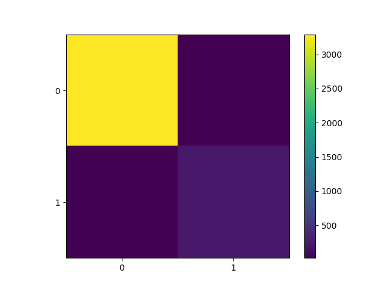

# Predicting-Pulsar-Star
Machine learning Python script implementing Support Vector Classifier using Gaussian Kernel. This model will predict whether the observed star is Pulsar or not.

HTRU2 dataset from kaggle.com is used.
HTRU 2 Summary:
17,898 total examples.
1,639 positive examples.
16,259 negative examples.
Source: https://archive.ics.uci.edu/ml/datasets/HTRU2

Attributes in dataset are : 
Mean of the integrated profile, 
Standard deviation of the integrated profile, 
Excess kurtosis of the integrated profile, 
Skewness of the integrated profile, 
Mean of the DM-SNR curve, 
Standard deviation of the DM-SNR curve, 
Excess kurtosis of the DM-SNR curve, 
Skewness of the DM-SNR curve, 
Class.

```
Confusion Report
              precision    recall  f1-score   support

           0       0.99      0.99      0.99      3306
           1       0.92      0.84      0.88       274

    accuracy                           0.98      3580
   macro avg       0.96      0.92      0.94      3580
weighted avg       0.98      0.98      0.98      3580


Error
0.017318435754189943

Confusion Matrix
[[3287   19]
 [  43  231]]
```


